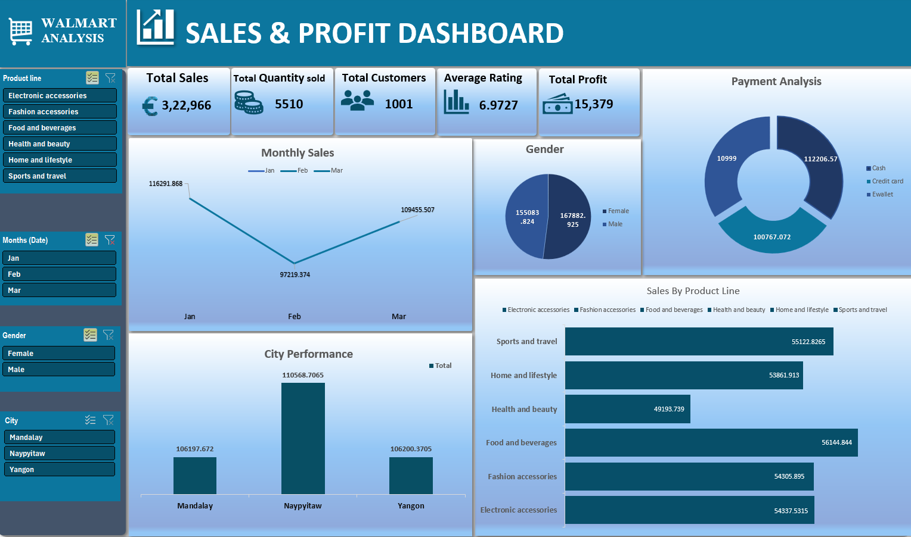

# 📊 Walmart Sales & Profit Dashboard (Excel)

## 📌 Overview

This project is an interactive Excel dashboard created to analyze sales and profit performance.

## 🛠 Tools Used

* Microsoft Excel
* Pivot Tables
* Slicers
* Charts

## 📊 Key Insights

* Monthly sales trends
* Product line performance
* City-wise analysis
* Payment method insights

## 📷 Dashboard Preview

## 🚀 Outcome

This project helped me understand data visualization and business insights using Excel.
